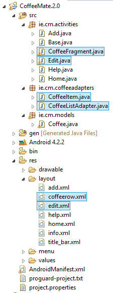

#Setup - Starter Code

As with the previous lab, you can download some starter code for this lab here - [CoffeeMate.2.0.Starter](../archives/CoffeeMate.2.0.Starter.zip). It contains all the resources you'll need to complete this lab along with some of the code.

To open this in eclipse, first extract the archive somewhere on our hard disk (preferably, your workspace). Then, in Eclipse, select 'File->Import' menu option, and in the dialog select 'Existing Projects into Workspace' (like you did in Lab 2)

Once you import the <b>CoffeeMate 2.0 Starter</b> Project it should looks as follows:

Take some time to familiarise yourself with the <b>new (highlighted)</b> classes in your project and explore the resources that you will be referring to throughout the lab, especially the layouts in both 'Graphical Layout' view and 'XML' view. It's also probably a good idea to run the App at this stage too, so you can set up your AVD (if you haven't done so already) and confirm that the starter app is configured properly and running (so basically it's Version 1 with a few style changes).

In this lab, you are required to do the following:

- Display the list of Coffees in a visually appealing list.

- Allow Coffees in the list to be updated (edited) and/or deleted from the list.

The following steps will guide you through these requirements, so we'll start with displaying the Coffees in a nice list.

 