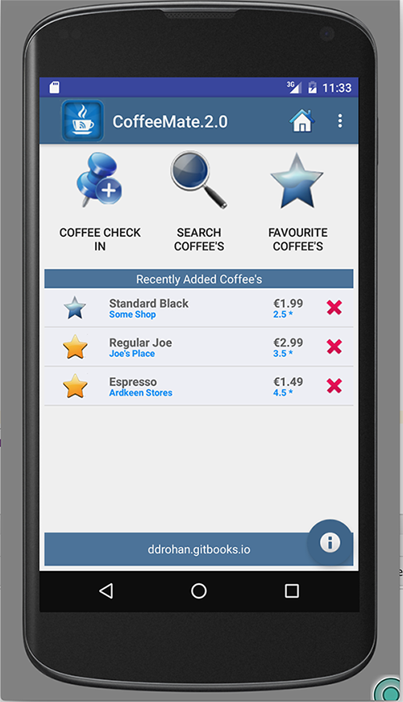

#Our 'new look' Home Screen

When we're finsihed this lab, we'll have something like this

So, first of all, have a quick look again at the resource layout (home.xml). We're using a <b><i>FrameLayout</i></b> as the container for our List of Coffees, which ultimately holds a <b>Fragment</b>, but we'll talk more about that later.

Once you've had a look at the layout, open your <b>Base.java</b> Activity class and familiarize yourself with the new variables this class now has. 

There's two new instance variables 

~~~java
  protected Bundle            activityInfo; // Used for persistence (of sorts)
  protected CoffeeFragment    coffeeFragment; // How we'll 'share' our List of Coffees between Activities
~~~

The first thing to do is refactor the Home Screen <b><i>onCreate()</i></b> method to make use of a helper method, (<b><i>setupCoffees()</i></b>) so make sure your new <b><i>onCreate()</i></b> method looks something like this:

~~~java
  protected void onCreate(Bundle savedInstanceState) {
        super.onCreate(savedInstanceState);
        setContentView(R.layout.home);
        Toolbar toolbar = (Toolbar) findViewById(R.id.toolbar);
        setSupportActionBar(toolbar);
        toolbar.setLogo(R.drawable.ic_launcher1);

        recentList = (TextView) findViewById(R.id.recentlyAddedListEmpty);

        FloatingActionButton fab = (FloatingActionButton) findViewById(R.id.fab);
        fab.setOnClickListener(new View.OnClickListener() {
            @Override
            public void onClick(View view) {
                Snackbar.make(view, "Information", Snackbar.LENGTH_LONG)
                        .setAction("More Info...", new View.OnClickListener() {
                            @Override
                            public void onClick(View view) {
                                openInfoDialog(Home.this);
                            }
                        }).show();
            }
        });
        setupCoffees();
    }
~~~

Note that we have removed any Eventlistener settings - we now handle <b><i>onClick()</i></b> events in the layout (via the xml).

The <b><i>setupCoffees()</i></b> method adds a few Coffee objects to our static <b><i>coffeeList</i></b>, so maybe run the App again just to confirm you're not seeing a blank screen anymore, but your coffees.

Next we'll start with the task of displaying our Coffees in a custom ListView.