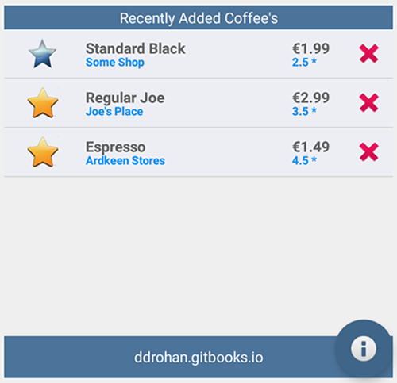

#Our 'new look' Home Screen - Displaying the List of Coffees

There are 3 major components (classes) involved in implementing this feature:

- <i>CoffeeItem</i>

- <i>CoffeeListAdapter</i>

- <i>CoffeeFragment</i>

We'll take each class in turn and insert the necessary code to complete this feature of the App.

 
#CoffeeItem

The main purpose of this class is to represent a single coffee row in our custom list, so the first thing we need to do is decide how the row should actually look - the associated layout (coffeerow.xml) is already supplied:

but familarise yourself with the widgets (the 'fields' or Views) as you will need to access them in your code.

Inside <b>CoffeeItem.java</b> you will need to finish the <b><i>updateControls()</i></b> method to ensure all the coffee data is displayed correctly. This will involve "binding" to each of the widgets (Views) on the layout and setting their value.  You can see how the coffee name widget is set below:

~~~java
private void updateControls(Coffee coffee) {
		((TextView) view.findViewById(R.id.rowCoffeeName)).setText(coffee.name);
		
		// Do the same for shop, rating, price & the favourite image here
		// and set the favourite on/off depending on the coffees favourite value	
	}
~~~

#CoffeeListAdapter

The main purpose of this class is to bind our coffeeList data to a particular view (a ListView in our case) and ultimately display it like so:

It's worth noting that this class is a <i><u>custom</u></i> adapter class, and it's the only way we get to display or coffee data in the "custom" format we want (ie our CoffeeItem rows) - if we were to use a standard Adapter, we would only be able to dislay our coffees in a very basic fashion.

To "customise" our adapter, we first say that it will manage Coffee Objects (already done) :

~~~Java
public class CoffeeListAdapter extends ArrayAdapter<Coffee> 
{
...
~~~

and then override a number of methods:

~~~Java
  @Override
  public View getView(int position, View convertView, ViewGroup parent)
  {
    return null;
  }

  @Override
  public int getCount()
  {
    return 0;
  }
  
  @Override
  public Coffee getItem(int position)
  {
	  return null;
  }

  @Override
  public long getItemId(int position)
  {
    return 0;
  }

  @Override
  public int getPosition(Coffee c)
  {
    return 0;
  }
}
~~~

Remember, the <b><i>getView()</i></b> method is auotmatically called for every object that exists in the underlying data (ie our coffeeList) so you should be returning a <b>CoffeeItem</b> reference here - try and have a go at this without referring to the notes.

The remaining methods are all related to the coffeeList itself, so again, give it a go without the notes!

#CoffeeFragment

The main purpose of this class is to allow us to reuse a component (the Fragment) which contains our list of coffees:

The only thing we need to do at this stage is create an instance of our custom adapter and associate it with our Fragment, so inside the <b><i>onCreate()</i></b> method of the fragment insert the following:

~~~Java
    listAdapter = new CoffeeListAdapter(activity, this, Base.coffeeList);
    setListAdapter (listAdapter);
~~~

---

The last thing we need to do is attach this Fragment to the Home Screen, so inside our <b><i>onResume()</i></b> method in <b><i>Home.java</i></b> you need to insert the following:

~~~Java
	  coffeeFragment = CoffeeFragment.newInstance(); //get a new Fragment instance
	  getFragmentManager().beginTransaction().add(R.id.fragment_layout, coffeeFragment).commit(); // add it to the current activity
~~~

You'll get an error on <i>R.id.fragment_layout</i> so you need to replace the <b>ListView</b> element in <b>content_home.xml</b> with the following:

~~~xml
<FrameLayout
	        android:id="@+id/fragment_layout"
	        android:layout_width="wrap_content"
	        android:layout_height="wrap_content"
	        android:layout_above="@+id/footerLinearLayout"
	        android:layout_alignParentLeft="true"
	        android:layout_alignParentRight="true"
	        android:layout_alignParentTop="true" />
~~~

Build your project and if you run your app again you should see your list displayed on the Home Screen like so:

and you should be able to "Add a Coffee" so make sure to check this functionality.

However, if you select a row in the list, or select the 'delete' button, nothing happens - that's the next step.