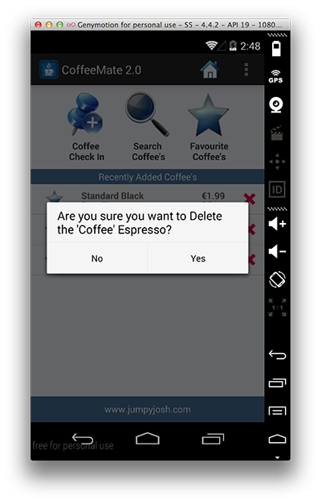

#Our 'new look' Home Screen - Delete a Coffee

Having a nice custom list isn't really much use unless the user can interact with the list by clicking on a row (or an element within the row). Over the next few steps we'll build in the ability to both edit a coffee's details, and if the user wishes, delete it from the list.

#Deleting a Coffee

To give the user the option of deleting a coffee (by pressing the 'X' button) we first need to "listen" for such an event, so we should attach some kind of Listener to that button. If you have a closer look at our <b>CoffeeItem</b> constructor, you'll see that we already have that setup:

~~~java
	ImageView imgDelete = (ImageView) view.findViewById(R.id.imgDelete);
	imgDelete.setTag(coffee);
	imgDelete.setOnClickListener(deleteListener);
~~~

Be clear about what is going on here as the <b><i>setTag()</i></b> method is important in the overall scheme of things.

The rest of the work we need to do is carried out in the <b>CoffeeFragment</b> class so firstly, look again at how we create our <b>CoffeeListAdapter</b> instance, <i>listAdapter</i>:

~~~java
listAdapter = new CoffeeListAdapter(activity, this, Base.coffeeList);
~~~ 

Notice that the <b>OnClickListener</b> parameter, is a reference to the class itself (<i>this</i>) so the <b>CoffeeFragment</b> class needs to implement this interface as follows:

You completed <b><i>onClick()</i></b> method should look something like this:

~~~java
@Override
  public void onClick(View view)
  {
    if (view.getTag() instanceof Coffee)
    {
      onCoffeeDelete ((Coffee) view.getTag());
    }
  } 
~~~

Here we use the Views 'Tag' to see if it's a coffee, and if it is, that's the one we delete. You can just copy & paste the following code for the <b><i>onCoffeeDelete()</i></b> method:

~~~java
public void onCoffeeDelete(final Coffee coffee)
  {
    String stringName = coffee.getCoffeeName();
    AlertDialog.Builder builder = new AlertDialog.Builder(activity);
    builder.setMessage("Are you sure you want to Delete the \'Coffee\' " + stringName + "?");
    builder.setCancelable(false);

    builder.setPositiveButton("Yes", new DialogInterface.OnClickListener()
    {
      public void onClick(DialogInterface dialog, int id)
      {
        Base.coffeeList.remove(coffee); // remove from our list
        listAdapter.coffeeList.remove(coffee); // update adapters data
        listAdapter.notifyDataSetChanged(); // refresh adapter
      }
    }).setNegativeButton("No", new DialogInterface.OnClickListener()
    {
      public void onClick(DialogInterface dialog, int id)
      {
        dialog.cancel();
      }
    });
    AlertDialog alert = builder.create();
    alert.show();
  }
~~~

Pay particular attention to the following:

~~~java
public void onClick(DialogInterface dialog, int id)
      {
        Base.coffeeList.remove(coffee); // remove from our list
        listAdapter.coffeeList.remove(coffee); // update adapters data
        listAdapter.notifyDataSetChanged(); // refresh adapter
      }
~~~

and understand what is happening here, as this is an important piece of the puzzle.

So now, when you run the app and select the delete button, you should get something like this:

and if you choose 'Yes', then the coffee should be removed from the list.

Now, onto editing a coffee.....
