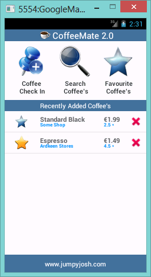

#Our 'new look' Home Screen - Edit a Coffee

The user now has the ability to delete (or remove) a coffee from the list of coffees displayed. But what if the user wants to update some of the coffees details? Maybe make it one of his or hers favourite coffees? That's what this step is about, so we'll be taking a similar approach as the previous step, but implementing a slightly different kind of Listener.

#Editing a Coffee

To give the user the option of Editing a coffee (by pressing the full row) we first need to "listen" for such an event, so we need to attach a Listener that 'listens' for individual row click events, and not just an element of the row. 

If you remember from the previous step, our <b>CoffeeFragment</b> was responsible for handling 'delete' events, so naturally, this class will also manage any updates or edits the user wants to make.

Open your <b>CoffeeFragment.java</b> and override the <b><i>onListItemClick()</i></b> method - this will execute everytime a user selects a single row (or listItem) in the list, so this is where you need to

- find out which coffee was selected (and it's 'ID')

- launch another activity so we can update the selected coffee

- make sure the change to our coffee is reflected in our coffeeList

We need to use <b>Bundles</b> and <b>Intents</b> and specifically, the first two parts are partially achieved as follows:

~~~java
	Bundle activityInfo = new Bundle(); // Creates a new Bundle object
    activityInfo.putInt("coffeeID", /* pass in the coffees id here */);
    
    Intent goEdit = new Intent(getActivity(), Edit.class); // Creates a new Intent
    /* Add the bundle to the intent here */
    getActivity().startActivity(goEdit); // Launch the Intent
~~~

Have a go at completing the above as best you can. 

Once you have that done, the rest of the work we need to do is carried out in the <b>Edit</b> Activity class so firstly, have a look at the <b><i>onCreate()</i></b> method - there's some code already in there, but if you try and run the app, it'll crash.

Any ideas why??

Next thing to do is setup the correct view for the activity - this is done using the <b><i>setContentView()</i></b> method, so see can you implement that, without referring to the solution below.

Also you need to 'bind' to and setup event handling on <i>favouriteImage</i> in the xml to avoid a NullPointerException, as follows:

~~~xml
android:onClick="toggle"
~~~

~~~java
favouriteImage = (ImageView) findViewById(R.id.favouriteImageView);
~~~

and you need to retrieve the 'coffeeID' from the Bundle, and get the coffee from our list using the <b><i>getCoffeeObject()</i></b> helper method - once again, try and have a go at this without referring to the solution code:

(and here it is!)

~~~java
  setContentView(R.layout.edit);
    
  activityInfo = getIntent().getExtras();
  aCoffee = getCoffeeObject(activityInfo.getInt("coffeeID"));

  favouriteImage = (ImageView) findViewById(R.id.favouriteImageView);
~~~

Now if you run your app, and select a row, you should launch the 'Edit' Screen.

However, there's nothing to edit - so that's the next step - displaying the coffee data so we can change it (like above).

