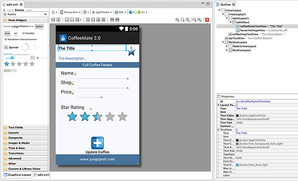

#Our 'new look' Home Screen - Edit a Coffee

We can now launch the Edit Screen, but nothing gets displayed, so there's nothing to edit. What we need to do now is 

- 'bind' the specific coffee data to the individual views/fields on the Edit Screen

- if any changes are made, ensure these changes are reflected in the global coffeeList

#Displaying the data for Update

First of all, open your <i>edit.xml</i> layout and familarise yourself with the 'names' or id's of all the relevant views you need to access (<i><u>coffeeNameTextView</u></i> is highlighted in the screenshot below).

And here's how we set the title 'field' to the name of the coffee

~~~java
setTextViewString(R.id.coffeeNameTextView, aCoffee.getCoffeeName());
~~~

Run the app again, and see what you get - now have a go at the rest of the coffee data using the helper methods from the Base class.

The completed section of missing code is as follows:

~~~java
		activityInfo = getIntent().getExtras();
		aCoffee = getCoffeeObject(activityInfo.getInt("coffeeID"));

		setContentView(R.layout.edit);
		setTextViewString(R.id.coffeeNameTextView, aCoffee.getCoffeeName());
		setTextViewString(R.id.coffeeShopTextView, aCoffee.getShop());

		setEditString(R.id.nameEditText, aCoffee.getCoffeeName());
		setEditString(R.id.shopEditText, aCoffee.getShop());
		setEditDouble(R.id.priceEditText, aCoffee.getPrice());
		setRatingBarValue(R.id.coffeeRatingBar, (float)aCoffee.getRating());

		favouriteImage = (ImageView) findViewById(R.id.favouriteImageView);

		if (aCoffee.getFavourite() == 1) {
			favouriteImage.setImageResource(R.drawable.ic_favourite_on);
			isFavourite = true;
		} else {
			favouriteImage.setImageResource(R.drawable.ic_favourite_off);
			isFavourite = false;
		}
~~~

including attaching a listener to the 'Update' Button, via xml.

~~~xml
android:onClick="update"
~~~

with our <b>toggle()</b> method looking something like this:

~~~java
public void toggle(View arg0) {

		if (isFavourite) {
			aCoffee.setFavourite(0);
			Toast.makeText(context, "Removed From Favourites",
					Toast.LENGTH_SHORT).show();
			isFavourite = false;
			favouriteImage
					.setImageResource(R.drawable.ic_favourite_off);			
		} else {
			aCoffee.setFavourite(1);
			Toast.makeText(context, "Added to Favourites !!",
					Toast.LENGTH_SHORT).show();
			isFavourite = true;
			favouriteImage.setImageResource(R.drawable.ic_favourite_on);
		}			
	} 
~~~

It's still not finished however - the <i><b>update()</b></i> method is nearly complete, but there's a few lines of (very important) code still to be added, so run the app once more and try and identiy what needs to be done to fully implement this Edit/Update feature.

You'll find the necessary code extracts in the the next step, but try and have a go before you proceed.
