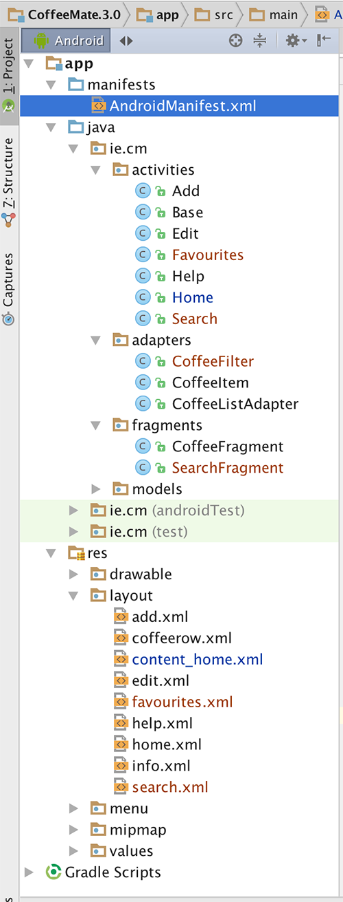

#Setup - Starter Code

As with the previous lab, you can download some starter code for this lab here - [CoffeeMate.3.0.Starter](../archives/CoffeeMate.3.0.Starter.zip). It contains all the resources you'll need to complete this lab along with some of the code.

Once you open the <b>CoffeeMate 3.0 Starter</b> Project in Android Studio it should looks as follows:

Take a few moments to familiarise yourself with the <b>new</b> classes and layouts in your project and explore the resources that you will be referring to throughout the lab, especially the layouts in both 'Graphical Layout' view and 'XML' view. It's also probably a good idea to run the App at this stage too, so you can set up your AVD (if you haven't done so already) and confirm that the starter app is configured properly and running (although you'll only see a blank screen!).

In this lab, you are required to do the following:

- Display a list of the users 'Favourite' Coffees

- Allow Coffees in the list to be filtered on their type and name.

The following steps will guide you through these requirements, so we'll start with refactoring the necessary classes.

 