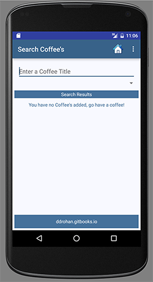
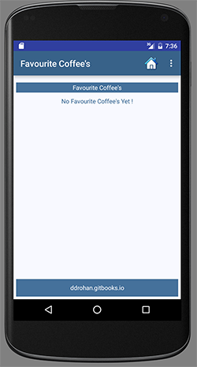

#CoffeeMate 3.0 - A First Look

When we're finsihed this lab, we'll be able to display the users Favourite coffees and apply a filter to the list of coffees so the user can search on a coffee name or type, or both. If you've run the starter code (and it's recommended you do) you'll see that the 'Search' & 'Favourites' buttons are working, but not functioning properly - we're not seeing any refined list of coffees.

  

Furthermore, there's nothing to select from the Spinner (second screenshot above) so this lab is all about refactoring existing classes to get these features working.

It's also worth taking a look at our <b>Home.java</b> below just to confirm you understand how we implemented the button functionality (see below).

The following steps will take you through completing <b><i>CoffeeMate 3.0</i></b>.

~~~java
package ie.cm.activities;

import android.os.Bundle;
import android.support.design.widget.FloatingActionButton;
import android.support.design.widget.Snackbar;
import android.support.v7.widget.Toolbar;
import android.view.View;
import android.widget.TextView;

import ie.cm.R;
import ie.cm.fragments.CoffeeFragment;
import ie.cm.models.Coffee;

public class Home extends Base {

    TextView recentList;

    @Override
    protected void onCreate(Bundle savedInstanceState) {
        super.onCreate(savedInstanceState);
        setContentView(R.layout.home);
        Toolbar toolbar = (Toolbar) findViewById(R.id.toolbar);
        setSupportActionBar(toolbar);
        toolbar.setLogo(R.drawable.ic_launcher1);

        recentList = (TextView) findViewById(R.id.recentlyAddedListEmpty);

        FloatingActionButton fab = (FloatingActionButton) findViewById(R.id.fab);
        fab.setOnClickListener(new View.OnClickListener() {
            @Override
            public void onClick(View view) {
                Snackbar.make(view, "Information", Snackbar.LENGTH_LONG)
                        .setAction("More Info...", new View.OnClickListener() {
                            @Override
                            public void onClick(View view) {
                                openInfoDialog(Home.this);
                            }
                        }).show();
            }
        });
    this.setupCoffees();
    }

    public void add(View v)
    {
        goToActivity(this,Add.class,null);
    }

    public void search(View v)
    {
        goToActivity(this,Search.class,null);
    }

    public void favourites(View v)
    {
        goToActivity(this,Favourites.class,null);
    }

    @Override
    protected void onResume() {
        super.onResume();

        if(coffeeList.isEmpty())
            recentList.setText(getString(R.string.recentlyViewedListEmptyMessage));
        else
            recentList.setText("");

            coffeeFragment = CoffeeFragment.newInstance(); //get a new Fragment instance
            getFragmentManager()
                    .beginTransaction()
                    .replace(R.id.fragment_layout, coffeeFragment)
                    .commit(); // add/replace in the current activity

    }

    public void setupCoffees(){
        coffeeList.add(new Coffee("Standard Black", "Some Shop",2.5,1.99,false));
        coffeeList.add(new Coffee("Regular Joe", "Joe's Place",3.5,2.99,true));
        coffeeList.add(new Coffee("Espresso", "Ardkeen Stores",4.5,1.49,true));
    }
}

~~~