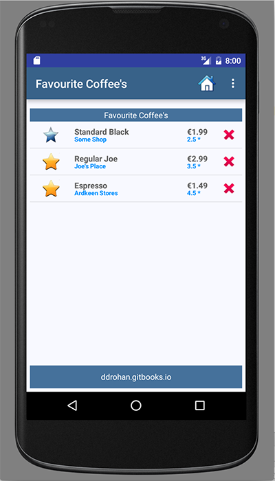

#Reusing Fragments - 'Search' & Favourites'

If you recall in <b><i>CoffeeMate 2.0</i></b> we used a <b><i>Fragment</i></b> to display our list of coffees inside our Home Screen. A Fragments main purpose is to be <u><i>reused</i></u> so we can use our existing Fragment in both our Search & Favourites Screens.

#Search & Favourites Screens

The first thing we'll do is add the Fragment to our <b>Search.java</b> and <b>Favourites.java</b> Activity classes. This is pretty staright forward as we have already done this in our <b>Home.java</b> in <b><i>CoffeeMate 2.0</i></b>.

~~~java
  coffeeFragment = CoffeeFragment.newInstance(); //get a new Fragment instance
            getFragmentManager()
                    .beginTransaction()
                    .replace(R.id.fragment_layout, coffeeFragment)
                    .commit(); // add/replace in the current activity
~~~

You can literally cut & paste the above code into both activity classes <b>onResume()</b> method and run the app, so see what you get?

And don't forget to use Android Studio's tools for overriding methods

and then

You should be seeing something like the following :

 

Obviously, our Favourites isn't filtered to show just 'Favourite Coffees' (we'll get to that later), but this does really illustrate the benefits of using Fragments when we can.

The next step is introducing the Filter so the user can view their Favourite Coffees (and eventually search).
