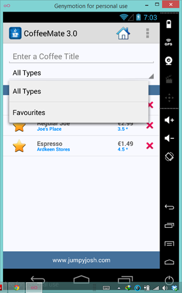

#Reusing Fragments - Searching Coffees

We now have a Fragment that has filtering capabilities so we use these to search our list of coffees and refine the list based on either the coffees name, it's type, or both. To achieve this, we'll subclass our existing <b><i>CoffeeFragment</i></b> and create new class called <b><i>SearchFragment</i></b> and associate this Fragment with our <b>Search.java</b> Activity class.

#SearchFragment.java

Have a quick look at the existing <b><i>SearchFragment</i></b> class:

~~~java
public class SearchFragment extends CoffeeFragment
		 {
	@Override
	public void onAttach(Context c) {
		super.onAttach(c);
	}

	@Override
	public void onCreate(Bundle savedInstanceState) {
		super.onCreate(savedInstanceState);
	}

	@Override
	public void onStart() {
		super.onStart();
	}
}
~~~

There's not much in there, so the first thing we'll do is add some choices to the Spinner so the user can filter on a 'type'.

We'll use an Adapter to populate the Spinner data so have a go at completing the following:

First, create the Adapter

~~~java
	ArrayAdapter<CharSequence> spinnerAdapter = ArrayAdapter
				.createFromResource(/*activity reference*/, /*the options to display*/,
						android.R.layout.simple_spinner_item);

	spinnerAdapter
		.setDropDownViewResource(android.R.layout.simple_spinner_dropdown_item);
~~~

Next, bind to the Spinner widget of the layout

~~~java
	Spinner spinner = /*Bind to the spinner widget R.id.searchCoffeeTypeSpinner*/;
~~~

and finally, set the Spinners adapter to the adapter you've set up (<i>spinnerAdapter</i>).

If you run your app again, you would expect to see the Spinner showing data - but it does not. Can you work out what the issue is? (HINT: Have a look at the <b>Search.java</b> Activity class and the type of Fragment being loaded)

If you've spotted what needed to be changed, run the app one more time and you should now be seeing something like this when you click on the Spinner.

 and 

The last step is to add the listeners for the <b><i>Spinner</i></b> and <b><i>EditText</i></b> widgets to filter the list on the users selections.