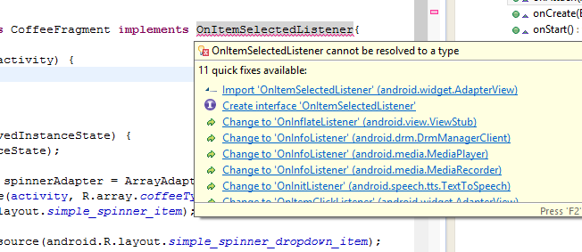
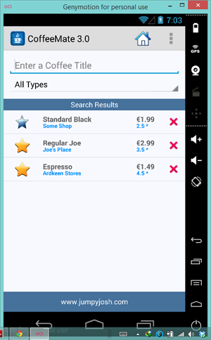

#Reusing Fragments - Adding Event Handlers

At the moment, if the user types in some text or selects an option from the Spinner on the Search screen, nothings happens as there's no code attached to these types of events. This step involves implementing the necessary interfaces to complete the lab.

If you haven't been doing so already, you should definitely make use of the Eclipse features to speed up this process, so all we will be left with is writing the specific code for what we want to happen.

#Handling the Spinner with the <u>OnItemSelectedListener</u> interface

First of all, ensure your <b>SearchFragment</b> implements the correct interface 

~~~java
implements AdapterView.OnItemSelectedListener
~~~

and use Android Studio to implement the interface methods like so 

and you get the following:

~~~java
  @Override
	public void onItemSelected(AdapterView<?> parent, View view, int position, long id) {
	
    }

	@Override
	public void onNothingSelected(AdapterView<?> parent) {

	}
~~~

We only need to complete the <i>onItemSelected</i> method to filter our list when the user selects a particular 'type' of coffee, as follows:

~~~java
  String selected = arg0.getItemAtPosition(arg2).toString();

    if (selected != null) {
      if (selected.equals("All Types")) {
        coffeeFilter.setFilter("all");
      } else if (selected.equals("Favourites")) {
        coffeeFilter.setFilter("favourites");
      }
      coffeeFilter.filter("");
    }
~~~

Once again, be clear about what is going here. The last thing to do is set the spinners listener, so have a go at this method call. 
If you like, you can run the app, just to see if this works like it should.

#Handling the EditText with the <u>TextWatcher</u> interface

Similar to handling the <b><i>Spinner</i></b> try and use the Eclipse features to implement the <b><i>TextWatcher</i></b> interface. If you've done this correctly you'll have the following method stubs:

~~~java
@Override
  public void afterTextChanged(Editable s) {
    // TODO Auto-generated method stub
    
  }

  @Override
  public void beforeTextChanged(CharSequence s, int start, int count,
      int after) {
    // TODO Auto-generated method stub
    
  }

  @Override
  public void onTextChanged(CharSequence s, int start, int before, int count) {
    // TODO Auto-generated method stub
    
  }
~~~

There's actually very little code necessary to implement this feature, so see if you can complete this final step without referring to the lecture material.

HINT: the <i>filter</i> method of our coffee filter takes a String to filter on and you need to add the relevant listener to the <b><i>EditText</i></b>.

Once you have that up and running you should be seeing something like this:

 