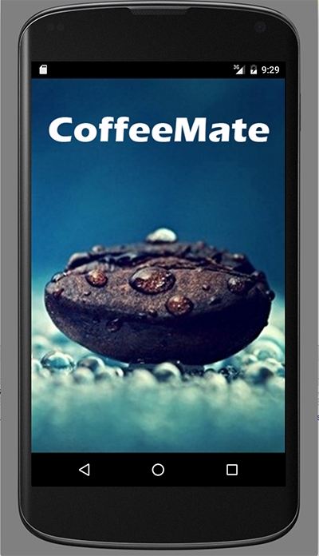
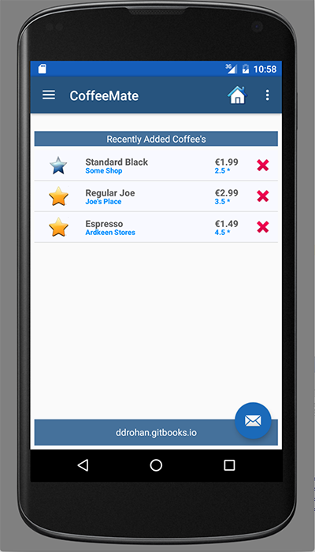

#Adding a Splash Screen

First of all, confirm that when you run the starter code you get the following:

and then

You've probably guessed we already have the Splash screen implemented, but

<i><b>Before you move on to the next step, it's worth taking a quick look at the manifest file to see the changed that have been made to ensure the Splash Screen acts like a 'Splash Screen', and is the first Screen you see when the app launches.</b></i>

It's also worth testing the app to see the 'Favourites' feature working and even delete/update and 'Favourite' coffees to see how the app handles an empty list.
