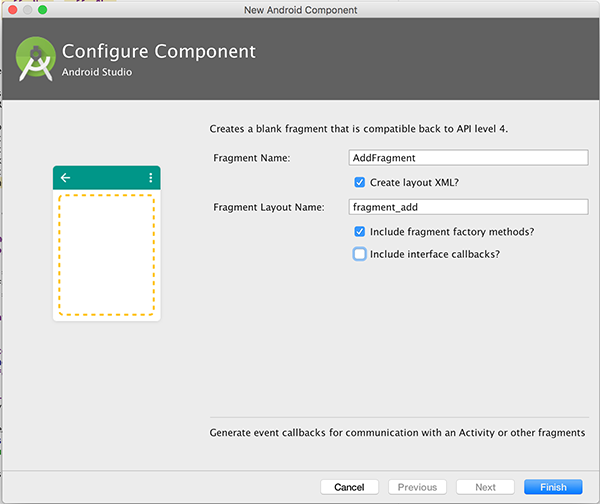

#Adding a Splash Screen

First of all, confirm that when you run the starter code you get the following:

and then nothing else.......

The reason for this is that the Splash Screen (the Splash Activity) doesn't specify what Screen should be loaded after the Splash Screen closes, so add the following code and fill in the correct Activity class name.

~~~java
 	Intent intent = new Intent(Splash.this, /*Enter Class Name to Load Here*/);
    Splash.this.startActivity(intent);
~~~

Run the app again and confirm you get the following (after the Splash Screen closes) :

<i><b>Before you move on to the next step, it's worth taking a quick look at the manifest file to see the changed that have been made to ensure the Splash Screen acts like a 'Splash Screen', and is the first Screen you see when the app launches.</b></i>
