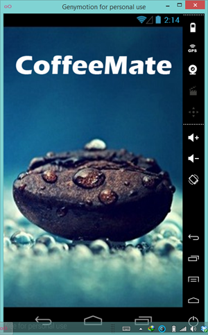

#App Refactoring - Our 'Add' Option (Part 1)

Once you've properly tested the latest version of CoffeeMate, you'll see that we only have The 'Home' & 'View Favourites' implemented (from the starter App). This step will take you through building a new Fragment <b>AddFragment</b> and reusing a lot of the 'Add' activity code and resources. 

First, go ahead and create a new (Blank) Fragment called <b>AddFragment</b> in the <i>fragments</i> package with the following options :

 

You'll get a fair bit of 'boilerplate' code, which we don't need for this project, so before continuing, ensure your new AddFragment initially looks like

~~~java
public class AddFragment extends Fragment {

    public AddFragment() {
        // Required empty public constructor
    }

    // TODO: Rename and change types and number of parameters
    public static AddFragment newInstance() {
        AddFragment fragment = new AddFragment();

        return fragment;
    }

    @Override
    public void onCreate(Bundle savedInstanceState) {
        super.onCreate(savedInstanceState);
     
    }

    @Override
    public View onCreateView(LayoutInflater inflater, ViewGroup container,
                             Bundle savedInstanceState) {
        // Inflate the layout for this fragment
        return inflater.inflate(R.layout.fragment_add, container, false);
    }
}
~~~

The next step is to replace the default fragment layout with our existing 'Add' activity layout so once you're done, you should have a layout like this for 'fragment_add'

 
 
 We can now go ahead and implement the necessary code to add this fragment to the 'Home Screen'. We won't implement the actual logic until the next step, we'll just get the 'Add' screen loading, so navigate to your <b>Home</b> activity class and see can you get the add feature to load the relevant screen.
 
 Note : if you get an import error on your <b>AddFragment</b> just ensure you have
 
 ~~~java
 import android.app.Fragment;
 ~~~
 
 in your import statements.
 
 
 
 