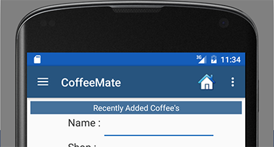

#App Refactoring - Our 'Add' Option

Once you've properly tested the latest version of CoffeeMate, you'll see that we only have The 'Home' & 'View Favourites' implemented (from the starter App). This step will take you through building a new Fragment <b>AddFragment</b> and reusing a lot of the 'Add' activity code and resources. 

First, go ahead and create a new (Blank) Fragment called <b>AddFragment</b> in the <i>fragments</i> package with the following options :

 

The Login Screen looks like this:

 