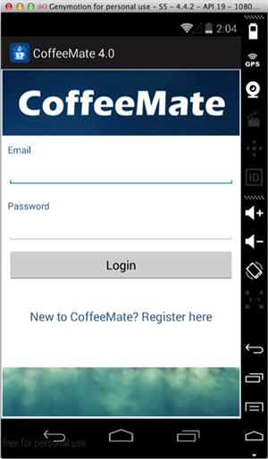
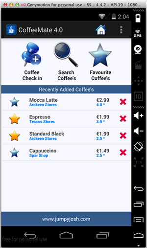

#App Refactoring - Our 'Search' Option (Part 1)
We'll take a similar approach with this feature as we did with the add feature - we'll get the navigation and screen up and running first, and then implement the logic.

In the previous version of CoffeeMate (Version 3.0) our 'Search' feature was implemented via a separate layout in a Search activity and we extended our <b>CoffeeFragment</b> to customise our Search (in a <b>SearchFragment</b>). To maintain our current <b><i>navigation design pattern</i></b> we should really remove the need for a 'Search' activity and manage everything in another Fragment - so that's what we'll do.

~~~java
 fragment = AddFragment.newInstance();
 ft.replace(R.id.homeFrame, fragment);
 ft.addToBackStack(null);
 ft.commit();
~~~

and just for completeness, you may have noticed that the title bar we're using for our 'Add' screen  still displays

 
 
 so add the following to your <b>AddFragment</b> (and fix the errors)
 
 ~~~java
  @Override
    public void onResume() {
        super.onResume();

        titleBar = (TextView) getActivity().findViewById(R.id.recentAddedBarTextView);
        titleBar.setText(R.string.addACoffeeLbl);
    }
 ~~~
 
 and run the app again to confirm you get the following
 
 

Now we can implement the logic behind the View to add a new coffee to our list of coffees.

We already have all the code we need in our 'Add' activity so go ahead and see can you complete this step without referring to the supporting lecture material.

And don't forget to remove the 'Add' activity (and associated layout) from the project, as we don't need them anymore.