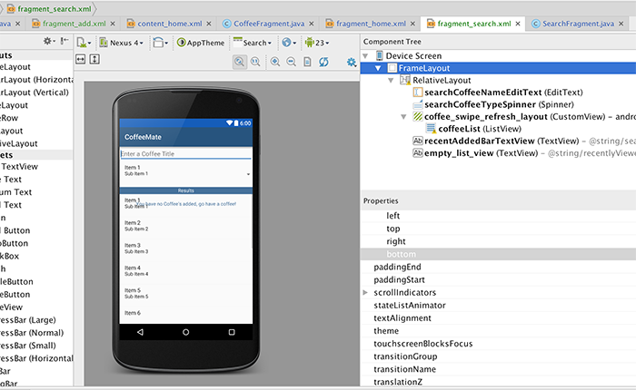

#App Refactoring - Our 'Search' Option (Part 1)
We'll take a similar approach with this feature as we did with the add feature - we'll get the navigation and screen up and running first, and then implement the logic.

In the previous version of CoffeeMate (Version 3.0) our 'Search' feature was implemented via a separate layout in a Search activity and we extended our <b>CoffeeFragment</b> to customise our Search (in a <b>SearchFragment</b>). To maintain our current <b><i>navigation design pattern</i></b> we should really remove our existing 'Search' activity and manage everything in another Fragment - so that's what we'll do.

First, we need a new layout for our Search, so either copy/paste one of the existing fragment layouts, or go ahead and create a new one (I copied the <i>fragment_home</i> layout and went from there).

We already have most of the layout we need in the 'Search' xml file so see can you put together a layout similar to the following:

If it all get's a bit much for you :) here's the complete xml code but it's really worth having a go yourself first, as it will help you develop your layout design skills.

~~~xml
 <FrameLayout xmlns:android="http://schemas.android.com/apk/res/android"
    xmlns:tools="http://schemas.android.com/tools"
    android:layout_width="match_parent"
    android:layout_height="match_parent"
    tools:context="ie.cm.fragments.SearchFragment">

    <RelativeLayout
        android:layout_width="fill_parent"
        android:layout_height="486dp"
        android:gravity="center" >

        <EditText
            android:id="@+id/searchCoffeeNameEditText"
            android:layout_width="match_parent"
            android:layout_height="wrap_content"
            android:inputType="text"
            android:hint="@string/searchCoffeeHint"
            android:layout_alignParentTop="true"
            android:layout_alignParentStart="true">

            <requestFocus />
        </EditText>

        <Spinner
            android:id="@+id/searchCoffeeTypeSpinner"
            android:layout_width="match_parent"
            android:layout_height="wrap_content"
            android:prompt="@string/searchCoffeeTypePrompt"
            android:layout_below="@+id/searchCoffeeNameEditText"
            android:layout_alignParentStart="true"
            android:paddingBottom="10dp" />

        <android.support.v4.widget.SwipeRefreshLayout
        android:id="@+id/coffee_swipe_refresh_layout"
        android:layout_width="match_parent"
        android:layout_height="107dp"
        android:layout_alignParentStart="true"
            android:layout_below="@+id/recentAddedBarTextView"
            android:layout_alignParentBottom="true">

        <ListView
            android:id="@+id/coffeeList"
            android:layout_width="match_parent"
            android:layout_height="match_parent"
            android:layout_gravity="right|bottom">
        </ListView>

    </android.support.v4.widget.SwipeRefreshLayout>

        <TextView
        android:id="@+id/recentAddedBarTextView"
        style="@style/banner"
        android:layout_width="match_parent"
        android:layout_height="wrap_content"
        android:text="@string/searchCoffeesResultsLbl"
        android:layout_gravity="center"
        android:layout_below="@+id/searchCoffeeTypeSpinner"
        android:layout_alignParentStart="true" />

        <TextView
            android:id="@+id/empty_list_view"
            android:layout_width="match_parent"
            android:layout_height="wrap_content"
            android:gravity="center"
            android:text="@string/recentlyViewedEmptyMessage"
            android:textColor="@color/headerBGColor"
            android:layout_alignParentTop="true"
            android:layout_alignParentStart="true"
            android:layout_marginTop="157dp" />

    </RelativeLayout>
</FrameLayout>

~~~

The next thing we need to do is associate this layout with our existing <b>SearchFragment</b> and bind to the widgets such as the Spinner, the EditText etc.

Even though our SearchFragment extends from CoffeeFragment, we can't use the standard CoffeeFragment layout so the first thing we need to do is bring in (and override) the <i>onCreateView()</i> method for our SearchFragment.

Introduce the following to your SearchFragment fragment

~~~java
@Override
	public View onCreateView(LayoutInflater inflater, ViewGroup container,
							 Bundle savedInstanceState) {

		return inflater.inflate(R.layout.fragment_search, container, false);
	}

Now, 'wire up' a new instance of this fragment to the Search option on the Navigation Drawer, similar to how we did the 'Add' and 'View Favourites'.

~~~