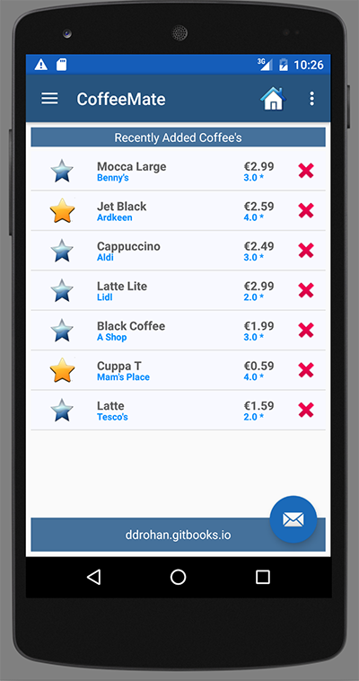

#Setup - Starter Code & Configuring Volley

As this lab builds directly on the previous lab, but requires a number of helper classes you can download the starter code for the lab here - [CoffeeMate.5.0](../archives/CoffeeMate.5.0.Starter.zip).

In this lab, you are required to do the following:

- Refactor <b>CoffeeMate.4.0</b> replacing all Database calls with the Web Service calls (one of which is done already). This particular lab is concerned with initially using <b>Volley</b> to make our API calls and ultimately intrgrating <b>Google+ Sign-in</b> to allows us to securely login to our sister Web App - <a href="http://coffeemateweb.herokuapp.com">CoffeeMateWeb</a> and still offer the same functionality on the App.

I would also like to bring to your attention our <b>Coffee</b> class as it has been refactored (simplified) for use with the Web Service, we will be using this version of the model in subsequent Labs.

Once you import the Starter Code, you'll notice a number of errors, so to fix these we need to import/include the <b>Volley</b> 'Module' in the project. To do this you can either

- clone the project (via git)

~~~java
git clone https://android.googlesource.com/platform/frameworks/volley 
~~~

or download my own volley archive here - [volley.zip](../archives/volley.zip).

Eitherway, you then need to 

~~~
File -> New Module, choose Import Existing Project
~~~
and Add the following dependencies to your 'build.gradle

~~~
compile project(':volley')
compile 'com.google.code.gson:gson:2.4' // for Googles Gson JSON Parser
~~~

Add the necessary imports, clean the Project and the errors should be fixed, and if you run the app, you should get something like the following (depending on what's on the server)

 

<i><b>I would strongly recommend spending some time familiarising yourself with the source code for this starter project - especially the API Calls and how we utilise a 'Callback Interface'.</b></i>

The remainder of this lab involves integrating <b>Google+ Sign-in</b> and using <b>Volley</b> to interact with the Web App.
