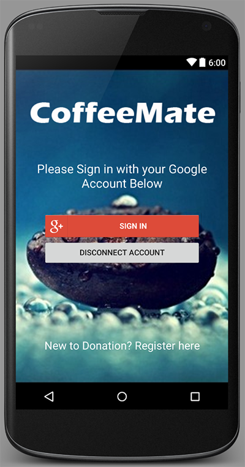
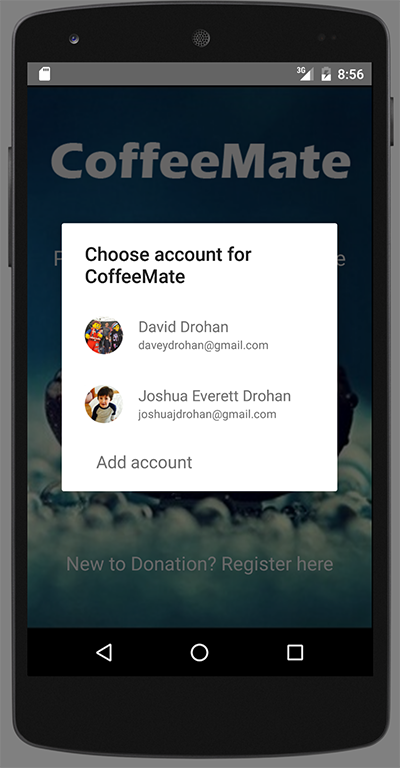
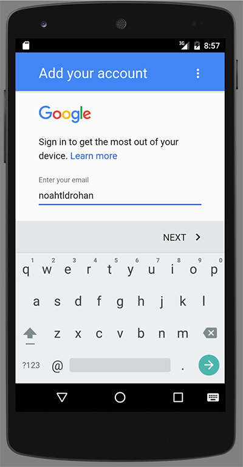
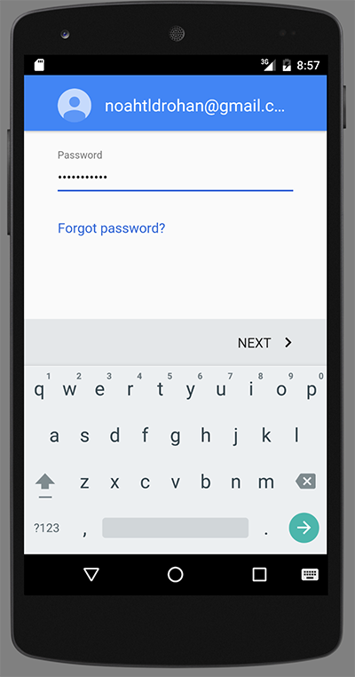
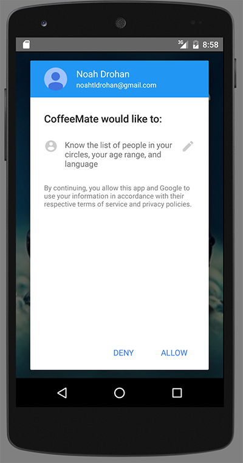
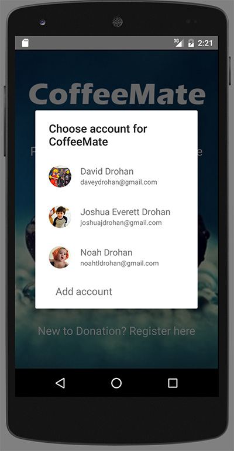
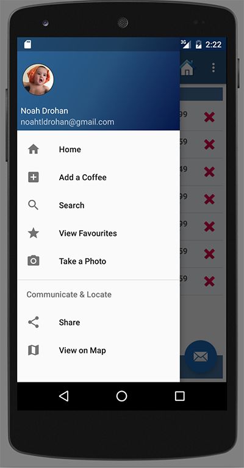

# Setting Up Google+ Sign-in

As previously mentioned, we now want our CoffeeMate App to interact with a sister Web App (<a href="http://coffeemateweb.herokuapp.com">CoffeeMateWeb</a>) so we need <b>Google+ Sign In</b> support to allow us to connect to the Web App and Add/Edit/Delete/View Coffees stored on the Server.

What we want is something like this:

When you've debugged through the classes & methods identified above, go ahead and experiment with some of the other methods, and enter breakpoints to investigate soem of the other web service calls.

