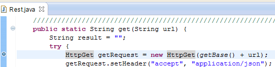
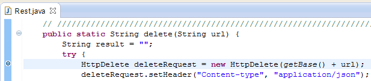
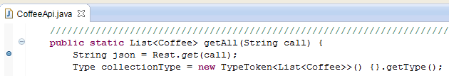
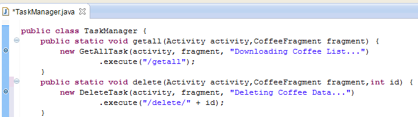
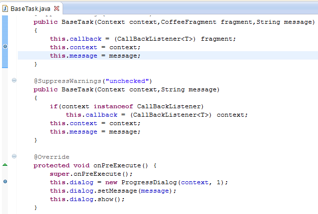
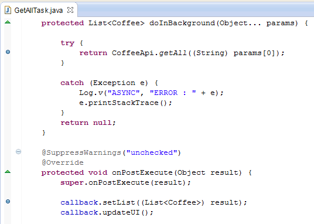
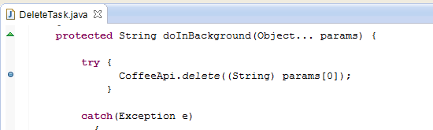

#Google+ Sign In 

As previously mentioned, this lab is all about understanding how <b>CoffeeMate.5.0</b> 

When you've debugged through the classes & methods identified above, go ahead and experiment with some of the other methods, and enter breakpoints to investigate soem of the other web service calls.