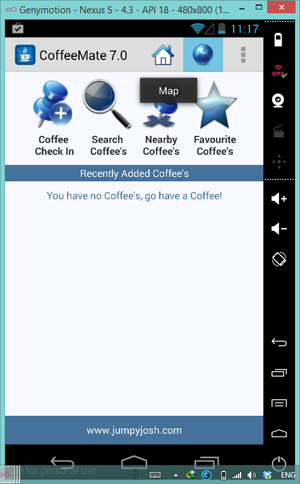
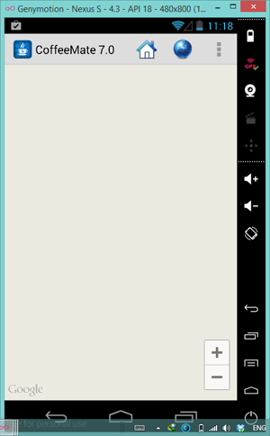
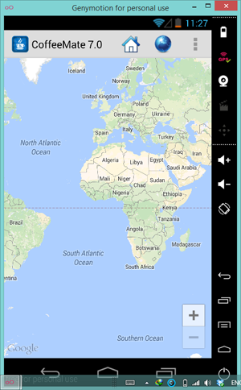

#Obtaining your Google Maps Key

First of all, confirm that when you run the starter code and select the 'Map' from the options menu, 

 

you get the following:

 

The grey grid should be displaying a map, but without a vaild key, this is what you get.

So follow the steps from the lectures [here](../archives/googlemapskey.pdf) to obtain your key.

Once you have your key, update your App and run it again <b>(NOTE : you may need to uninstall/reinstall the app)</b>, and if everything is set up correctly, you should see something like this:

Congratulations - you can now go ahead and build map based apps!
