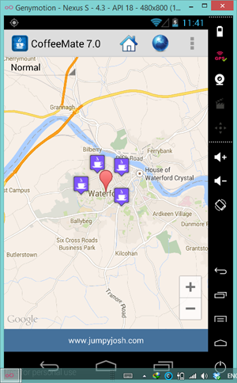

#View Users Current Location

Before you go any further, here's where we're at so far

- [CoffeeMate.6.0.sofar](../archives/CoffeeMate.7.0.sofar.zip)

At the moment, when the user selects the 'Map' menu option, they get to see a standard map, but not their own location (or even their coffee locations), so this step is about implementing the users location (we'll look at the coffees location in the next step).

As we will need to reuse this map again, it makes sense to use a <i>Fragment</i> so first of all download the necessary resources in [mapresources](../archives/mapresources.zip) and you will add them to the relevant packages/folders in your project as you need them.

The first class you need is <b>GeoBase.java</b>, this class holds a reference to a <i><b>GPSTracker</b></i> object to manage all the 'location' info, so drop that into the <i>ie.cm.activities</i> package. Take a few moments to familarise yourself with this class (and the other classes) as you will be making use of the class throughout the lab.

Next, you need to modify a few classes to make them 'location aware', namely <b>Add.java</b> and <b>Map.java</b> so modify those classes to extend from <b>GeoBase.java</b>.

Now, edit your <b>Add.java</b> and do the following:

Make this class implement the <i><b>IGPS</b></i> (callback) interface so that when the location changes, our <i>currentLocation</i> reference is updated. Once you add the methods to be implemented, you should have something like the following:

~~~java
@Override
	public void updateConnection() {}

	@Override
	public void updateLocation(Location l) {
		this.currentLocation = l;
	}
~~~ 

To ensure this callback mechanism works correctly, we need to set this class as the callback class like so (in the <i>onResume()</i> method):

~~~java
@Override
	public void onResume() {
		super.onResume();		
		gps.setCallBack(this);			
	}
~~~

And finally, so that when a coffee is being added, the latitude & longitude coordinates are also stored, like below:

~~~java
	if ((coffeeName.length() > 0) && (coffeeShop.length() > 0)
				&& (getEditString(R.id.priceEditText).length() > 0)) {
			Coffee c = new Coffee(coffeeName, coffeeShop, ratingValue,coffeePrice, 
					              0,currentLocation.getLatitude(),currentLocation.getLongitude());
			dbManager.insert(c);
			goToActivity(this, Home.class, null);
		} else
			toastMessage("You must Enter Something for Name and Shop");
~~~

The next step is displaying those coffees on the map, so firstly add the <b>MapPageFragment.java</b> class to the <i>ie.cm.fragments</i> package. Again, take some time to have a look through this class, as there's a lot going on, particularly in the following two methods:

~~~java
	public void refreshMap() {
		mMap = mapfragment.getMap();
		mMap.clear();
		mMap.setOnCameraChangeListener(this);
		//For Emulator Testing //////////////////////////
		if(currentLocation == null)
			currentLocation = gps.setDefaultLocation();
		/////////////////////////////////////////////////
		mMap.animateCamera(CameraUpdateFactory.newLatLngZoom(MapUtils.locationToLatLng(currentLocation), mapZoomLevel));
		user = MapUtils.drawUsersCurrentLocation(currentLocation, mMap);
	}
 
	public void drawCoffeeMapMarkers() {
		if (this.activity.dbManager.getAll() != null) {
			for (Coffee c : this.activity.dbManager.getAll()) {
				mMap.addMarker(new MarkerOptions().position(c.getLatLngPoint()).title(c.name)
						.snippet(c.shop + " : " + c.rating + "*" + "\n€" + c.price).icon(BitmapDescriptorFactory.fromResource(R.drawable.coffee)));
			}
		}
	}
~~~

so make sure you understand (most of :-)) what's going on here.

Now that we have our Map fragment available, we can 'add' this to our <b>Map.java</b> to display our coffees when the user chooses the Map menu option. First, edit your <b>Map.java</b> and add in (or uncomment) the following:

~~~java
@Override
	protected void onResume() {
		super.onResume();
		MapPageFragment mapPage = (MapPageFragment) MapPageFragment.newInstance();
		getSupportFragmentManager()
			.beginTransaction()
			.add(R.id.fragment_layout, mapPage)
			.commit();
	}
~~~

Then edit your <b>viewmap.xml</b> and comment out the 'SupportMapFragment' and paste in the 'FrameLayout', like so

~~~xml
 <FrameLayout
      android:id="@+id/fragment_layout"
      android:layout_width="wrap_content"
      android:layout_height="wrap_content"
      android:layout_alignParentBottom="true"
      android:layout_alignParentLeft="true"
      android:layout_alignParentRight="true" >
    </FrameLayout>
    
  <!-- 
    <fragment
        android:id="@+id/map_fragment"
        android:layout_width="match_parent"
        android:layout_height="match_parent"
        class="com.google.android.gms.maps.SupportMapFragment" />
	-->
~~~

If you run the app again and choose to display the map, you should see something like this (once you have coffees in your list):

<b>And if you change your location on the Genymotion map, you should see your location updated on the CoffeeMate map. You should experiment with changing your location and adding some coffees to confirm that the added coffees are displayed correctly on the map.</b>