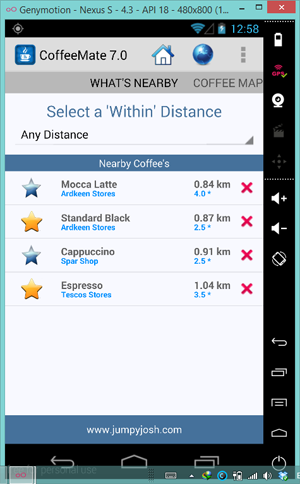
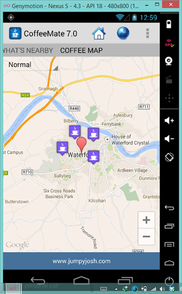

#View Users Current Location - Part II

The previous step was mostly about adding in a lot of boilerplate code to our Fragment, to get things moving - a lot of which you would have seen in the lecture material that covers Location and Google Maps.

This step adds a bit more of that, but also adds some bespoke code specific to CoffeeMate and its features.

Firstly, edit your <b>MapsFragment</b> and add/replace the following methods

~~~java
  public void nearby(View v) {
      goToActivity(this, Nearby.class, null);
  }
~~~

Next, make sure this new class is referenced in the manifest file:

~~~java
<activity android:name="ie.cm.activities.Nearby"></activity>
~~~

While you're working with the manifest file, take a moment to examine all the permissions necessary for location features in the app - this can commonly throw up errors if you don't have the necessary permissions set when requesting certain features. Also, note the following:

~~~java
<activity android:name="ie.cm.activities.Map"
            android:configChanges="orientation|screenSize">
</activity>
~~~

This forces the Map <b>NOT</b> to be recreated if the orientation changes, which should only be used as a last resort, but does ensure our app won't crash on a screen change. (Not my best work!!, but it is due to known google map v2 issues :-D)

Now, if you run the app again, and select 'Nearby', you should see the following (which you can swipe between):

      

Carry out some testing, and see if you can find a bug in the app, related to syncing between the list and the map in the ViewPager.