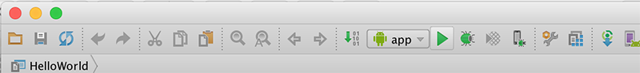

#First Android Project - "HelloWorld"

In Android Studio, select File->New->New Project, or if it's a first run, select "Start a new Android Studio Project"

Press "Next" (or click the option) and then give the project a name: 'HelloWorld'

It's recommended you change the default package name also and it's probably worth changing the Project Location too but you can take the default for the moment.

Select the Platform(s) you want your app to run on - we'll just stick with Phone & Tablet and choose an appropriate Minimum SDK.

You should choose a Blank Activity as your activity type on the next screen

and name it as in the screenshot below

After you press "Finish", you should now have something similar to the following:

Next, as an exercise, select File->Close Project, to close the project so we can import it again.

If no other Projects are open you will be displayed with

So, to import the project, select "Open an Existing Android Project" and navigate to the Project folder where you android app is stored (like <b>'HelloWorld'</b> below)

Familiarise yourself with the project layout - the initial xml layout or "screen" is first displayed, this is one of the many resources you will be using and creating throughout this module. We will experiment later with modifying this layout, but first you should run the application.

Select the Project (HelloWorld) and then select the 'Play' button as below

If you haven't done so already, you will be asked to select/create an AVD (Android Virtual Device), as follows:

and

Use the settings as above and your first Android App should launch like so, (Once you've unlocked the device!):

