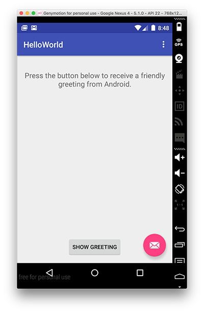

#Our version of "HelloWorld"

In this Step, you will be required to develop and run your own version of the "Hello World" Android Project (as seen below).

If you've deleted your HelloWorld Project, launch Android Studio (if it's not already open) and create a new Android Project called <b>HelloWorld</b> similar to what you did in Step 02. 

If you haven't deleted the project, you can just continue on.

Name your package 'ie.wit' (or accept the default again). Accept all the defaults, and it's recommended you select <b>Android 5.0</b> as the launch target platform (but any target will suffice for this particular lab). It's also probably a good idea to run the App at this stage, so you can set up your Virtual Device (if you haven't done so already).

Edit your "strings.xml" file (in your res folder) and add the following "resources" - be careful if you have created an app which contains a 'menu' folder, this also includes associated resources, so don't overwrite those resources, just add our ones at the end.

~~~xml
    <string name="window_text">Press the button below to receive a friendly greeting from Android.</string>
    <string name="button_label">Show Greeting</string>
    <string name="greeting_text">Hello from Android!</string>
~~~

Your completed strings.xml should look like this
~~~xml
<resources>
    <string name="app_name">HelloWorld</string>
    <string name="action_settings">Settings</string>
    <string name="window_text">Press the button below to receive a friendly greeting from Android.</string>
    <string name="button_label">Show Greeting</string>
    <string name="greeting_text">Hello from Android!</string>
</resources>
~~~

If you choose "open editor you can see the graphical representation of the String resources you have set up (and edit them here if you need to).

Now, edit your <b>"content_hello_world.xml"</b> <u><i>in your <i>layout</i> folder</i></u> and replace your <b>TextView</b> with the following

~~~xml
<TextView
        android:id="@+id/textView1"
        android:gravity="center"
        android:layout_width="wrap_content"
        android:layout_height="wrap_content"
        android:layout_marginTop="20dp"
        android:text="@string/window_text"
        android:textAppearance="?android:attr/textAppearanceMedium" />

    <Button
        android:id="@+id/greetingButton"
        android:layout_width="wrap_content"
        android:layout_height="wrap_content"
        android:layout_alignParentBottom="true"
        android:layout_centerHorizontal="true"
        android:layout_marginBottom="59dp"
        android:onClick="showGreeting"
        android:text="@string/button_label" />
~~~

This will give you the following layout:

Once again, it's worth running the app at this point to confirm everything is displayed the way we want it. If you click the button, your app will probably crash - we don't have our <b>showGreeting()</b> method implemented yet.

The last thing we need to do is add in our event handling code so that a short message is displayed when the user presses the 'Show Greeting' button.

Firstly, open up the "HelloWorldActivity.java" source file and add the following method

~~~java
public void showGreeting(View v) {
        // TODO Auto-generated method stub
        String greetingText = getString(R.string.greeting_text);
        Toast tempMessage = Toast.makeText(this, greetingText, Toast.LENGTH_LONG);
        tempMessage.show();
    }
~~~

Note that we have no need for some kind of Listener interface (ala swing development) - our event handling is taken care of via the 'onClick' attribute in our xml layout, here's what your completed Activity class should look like.

~~~java
package ie.wit.helloworld;

import android.os.Bundle;
import android.support.design.widget.FloatingActionButton;
import android.support.design.widget.Snackbar;
import android.support.v7.app.AppCompatActivity;
import android.support.v7.widget.Toolbar;
import android.view.View;
import android.view.Menu;
import android.view.MenuItem;
import android.widget.Toast;

public class HelloWorldActivity extends AppCompatActivity {

    @Override
    protected void onCreate(Bundle savedInstanceState) {
        super.onCreate(savedInstanceState);
        setContentView(R.layout.activity_hello_world);
        Toolbar toolbar = (Toolbar) findViewById(R.id.toolbar);
        setSupportActionBar(toolbar);

        FloatingActionButton fab = (FloatingActionButton) findViewById(R.id.fab);
        fab.setOnClickListener(new View.OnClickListener() {
            @Override
            public void onClick(View view) {
                Snackbar.make(view, "Replace with your own action", Snackbar.LENGTH_LONG)
                        .setAction("Action", null).show();
            }
        });
    }

    @Override
    public boolean onCreateOptionsMenu(Menu menu) {
        // Inflate the menu; this adds items to the action bar if it is present.
        getMenuInflater().inflate(R.menu.menu_hello_world, menu);
        return true;
    }

    @Override
    public boolean onOptionsItemSelected(MenuItem item) {
        // Handle action bar item clicks here. The action bar will
        // automatically handle clicks on the Home/Up button, so long
        // as you specify a parent activity in AndroidManifest.xml.
        int id = item.getItemId();

        //noinspection SimplifiableIfStatement
        if (id == R.id.action_settings) {
            return true;
        }

        return super.onOptionsItemSelected(item);
    }

    public void showGreeting(View v) {

        String greetingText = getString(R.string.greeting_text);
        Toast.makeText(this, greetingText, Toast.LENGTH_LONG).show();
    }
}

~~~

We will investigate this code more closely in the lectures.