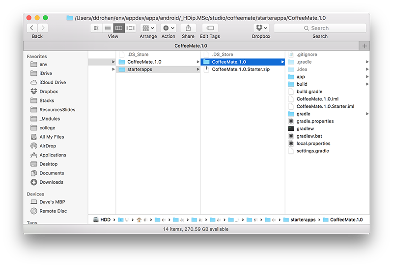
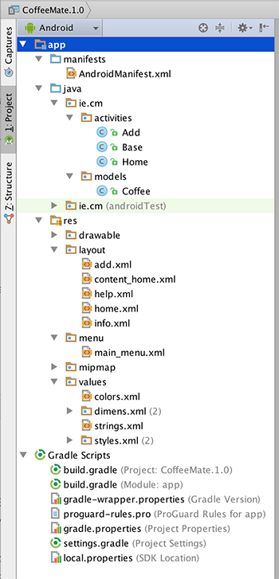

#Setup - Starter Code

To make things a bit easier, you can download some starter code for this lab here - [CoffeeMate.1.0.Starter](../archives/CoffeeMate.1.0.Starter.zip). It contains all the resources you'll need to complete this lab along with some of the code.

To open this in eclipse, first extract the archive somewhere on our hard disk (preferably, your workspace). Then, in Eclipse, select 'File->Import' menu option, and in the dialog select 'Existing Projects into Workspace'

When you browse to and select the folders to which the project have expanded, you should see this:

 
Note carefully the 'Copy Project into Workspace' option. If you select this, then the full project will be copied into your 'workspace' folder. If you leave in unchecked (which you should for this lab), then it will remain in the folder where you unzipped it, but it will be 'linked to' from your workspace. 

Another complication is that the projects cannot be imported into a workspace which already contains projects with the same name. If this is the case, you can create a new workspace (File->Switch Workspace) and import these projects there.

Once you import the Starter Project it should looks as follows:

Take a few moments to familiarise yourself with the different Activities and classes in your project and explore the resources that you will be referring to throughout the lab, especially the layouts in both 'Graphical Layout' view and 'XML' view. It's also probably a good idea to run the App at this stage too, so you can set up your AVD (if you haven't done so already) and confirm that the starter app is configured properly and running.

In this lab, you are required to do the following:

- "Wire up" the Coffee Check-In Button to our 'Add' activity to display the Add screen.

- Implement the 'Standard Menu' so when a user selects the menu option on the device, they are presented with a list of options in a menu format.

- Implement the 'Help' activity, so that when a user selects 'Help' from the 'Standard Menu', the Help Screen is displayed

- Complete the 'Add' activity to allow a user to 'add' a new coffee to the current list of coffees.

The following steps will guide you through these requirements, so we'll start with the most straightforward requirement, getting our Coffee Check-In Button working.

 