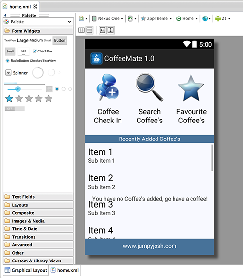
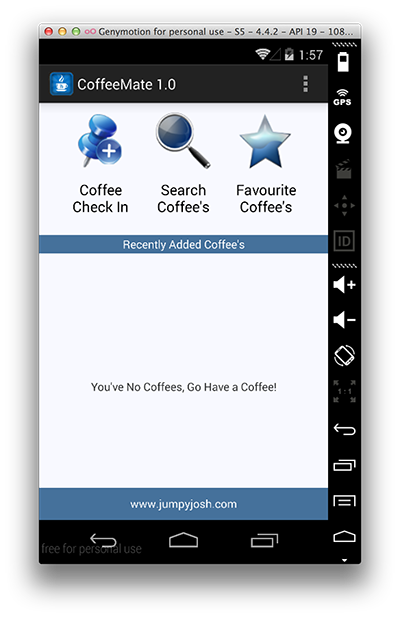

#Adding a Coffee - Switching to our 'Coffee Check In' Screen

First of all, have a quick look at the resource layout (content_home.xml) we will be referring to, and familiarise yourself with the "id's" of the different buttons, as you will have to refer to these in your code.

Next, open your <b>Home.java</b> Activity class and in the <b><i>onCreate()</i></b> method insert the following code to bind to the button and attach an event listener.

~~~java
    Button addACoffeeButton = (Button)findViewById(R.id.addACoffeeBtn);
	addACoffeeButton.setOnClickListener(this);
~~~

NOTE: Ensure you insert this code <b>AFTER</b> the layout has been set - what are the implications if the code was inserted BEFORE the layout was set?

Your <b><i>onClick()</i></b> code should look something like this

~~~Java
switch(v.getId()) {
    case R.id.addACoffeeBtn:
        goToActivity(this,Add.class,null);
        break;
    case R.id.searchCoffeesBtn:

        break;
    case R.id.favouritesCoffeeBtn: 

        break;
    }
~~~

Be sure you understand what's happening here as we will be revisiting this method throughout the labs and adding in the extra functionality as we go along. 

Finally, your <b><i>onResume()</i></b> method is already complete, but again, familiarise yourself with the inner workings of the method as you will need to do something similar in your <b>Add.java</b> Activity class later on.  

You should run your app at this stage just to see if it behaves like it should.

You will, more than likely, get an error along the lines of 

~~~
android.content.ActivityNotFoundException: Unable to find explicit activity class {ie.cm.models/ie.cm.activities.Add};
~~~

Can you work out why, and more importantly, how to fix it? (Hint : it involves the AndroidManifest.xml file and you can find the answer in the section on Intents already covered in the lectures).

Run the app again once you have solved this issue, to confirm everything is ok so far.

Next we'll start with implementing the menu.