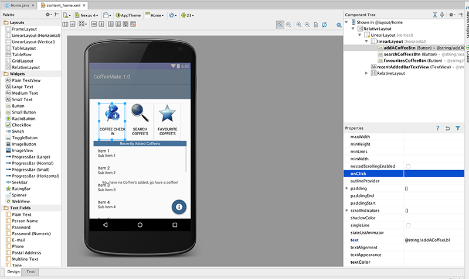
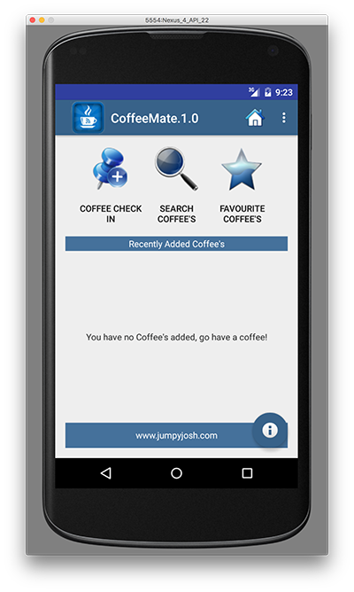

#Adding a Coffee - Switching to our 'Coffee Check In' Screen

First of all, have a quick look at the resource layout (content_home.xml) we will be referring to, and familiarise yourself with the properties of the different buttons, especially the <b>onClick</b>, as you will have to refer to these in the following steps.

We <b>won't</b> need to implement specific Event Listeners for this step, instead we will use the simpler 'direct binding' approach where we associate a method to be triggered when our button is pressed. 

So, navigate to the <b>onClick</b> property of the 'Coffee Check In' button (as above) and enter <b>add</b> for the method name.

Next, open your <b>Home.java</b> activity and add the following method

~~~java
    public void add(View v)
    {
    goToActivity(this,add.class,null);
    }
~~~

You should run your app at this stage just to see if it behaves like it should.

You will, more than likely, get an error along the lines of 

~~~
android.content.ActivityNotFoundException: Unable to find explicit activity class {ie.cm.models/ie.cm.activities.Add};
~~~

Can you work out why, and more importantly, how to fix it? (Hint : it involves the AndroidManifest.xml file and you can find the answer in the section on Intents already covered in the lectures).

But before we modify the AndroidManifest File, there's a few other additions to the project we need to make, i.e. 

* we need to add a new <i>style</i> so we can display our Add screen properly like so

~~~XML
 
~~~
and

* we need to modify our <i>RatingBar</i> so we get to see nice blue stars (and not grey ones!) so set the following property

~~~XML
    android:progressTint="@color/bannerBGColor"
~~~

* Finally, add the following to your manifest file

~~~xml
 <activity
    android:name=".activities.Add"
    android:label="@string/addACoffeeLbl"
    android:theme="@style/AppTheme.ActionBar" >
</activity>
~~~

and run the app again to confirm everything is ok so far.

Next we'll start with implementing the menu.