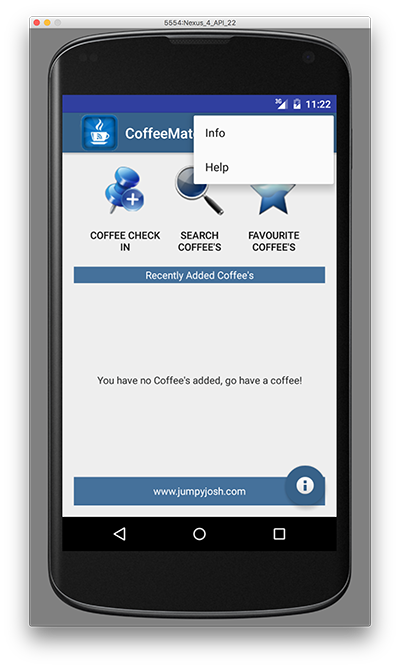
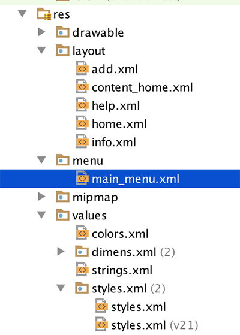
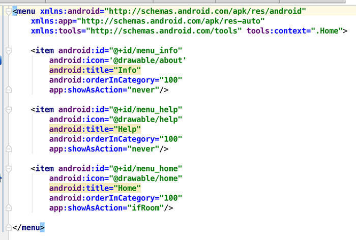
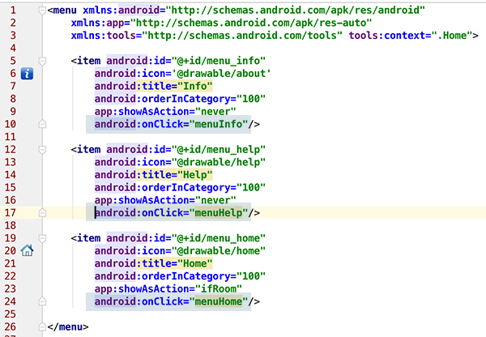
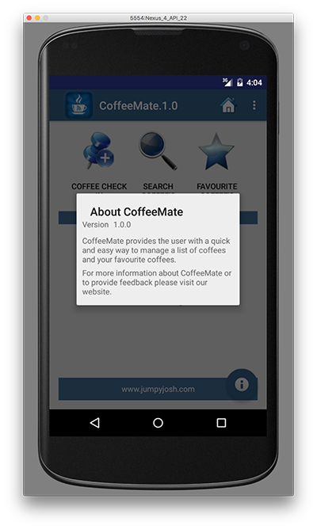

#Our Custom Menu

On completion of this step we'll have something like this:

which we sort of already have, but we'll add functionality. So once again, have a quick look at the resource (below) we will use to create our menu, and familiarise yourself with the "id's" of the different options, you will have to refer to these later on in your code.

and the xml...

Maybe you noticed (or maybe you didn't!) that our 'Add' screen has no menu - this is because we never 'inflated' the menu in our activity. 

So, open up the <b>Base.java</b> Activity class, and add in or "override" the methods we need to implement our menu (as we want the same menu for all our screens) i.e. <b><i>onCreateOptionsMenu()</i></b>. We are overriding the method here so that the menu will be available to all classes that extend from our base class. You could also just move the method from <b>Home.java</b> to <b>Base.java</b> too.

Run your app again just to confirm you can now see the menu on all screens.

Now, to keep things as simple as possible, we're going to take the same approach with our Menu as we did with our 'Coffee Check In Button' - we'll use the <b>onClick</b> property to bind a menu item to a particular method in our activity.

So open up your <b>main_menu.xml</b> and add the following to each of the menu items (as in the screenshot below)

Then, open up your <b>Base.java</b> and add the following methods

~~~java
 public void menuInfo(MenuItem m)
    {
        openInfoDialog(this);
    }

    public void menuHelp(MenuItem m)
    {
      //  goToActivity(this, Help.class, null);
    }

    public void menuHome(MenuItem m)
    {
        goToActivity(this, Home.class, null);
    }
~~~

You'll notice we haven't implemented the <b>menuHelp</b> method - as we don't have our <b>Help</b> activity yet but you can still run your app and confirm that the other two methods function as expected.

Once you have these two methods implemented, that's basically it, but as we really only have two activities at the moment (our 'Home' & Add Activities) the menu won't do much, but we'll add to this once we have our Help Screen completed - run your app again to test your menu and see if it displays the way it's supposed to. (something like below for the 'info' option)

Next we'll add in our new Help screen.

