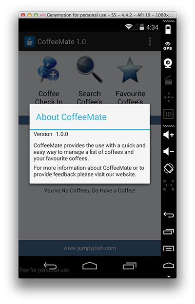

#Our Custom Menu

On completion of this step we'll have something like this:

which we sort of already have, but we'll add functionality. So once again, have a quick look at the resource (below) we will use to create our menu, and familiarise yourself with the "id's" of the different options, you will have to refer to these later on in your code.

and the xml...

Maybe you noticed (or maybe you didn't!) that our 'Add' screen has no menu - this is because we never 'inflated' the menu in our activity. 

So, open up the <b>Base.java</b> Activity class, and add in or "override" the methods we need to implement our menu (as we want the same menu for all our screens) i.e. <b><i>onCreateOptionsMenu()</i></b>. We are overriding the method here so that the menu will be available to all classes that extend from our base class. You could also just move the method from <b>Home.java</b> to <b>Base.java</b> too.

Run your app again just to confirm you can now see the menu on all screens.

Inside <b><i>onCreateOptionsMenu()</i></b> you'll need to 'inflate' our resource (our xml menu file) so have a look at the notes on how to do that if you're not sure and in our <b><i>onMenuItemSelected()</i></b> we need to write our conditional test so that the correct Activity is launched when a user selects an option. 

This is where you refer to the id of the specific resource. You should be able to make use of our helper goToActivity() method (also in the base class) to switch between Activities.  Once again you should probably refer to the notes on this one, if you're a bit sketchy and insert the following code in the correct place

~~~java
switch(item.getItemId()) 
  {
  case R.id.help : 
                break;
  case R.id.info : openInfoDialog(this);
                break;
  case R.id.home : goToActivity(...); //pass in the relevant parameters 
                break;
  }
~~~

Once you have these two methods implemented, that's basically it, but as we really only have one activity at the moment (our 'Home' Activity) the menu won't do much, but we'll add to this once we have our Help Screen completed - run your app again to test your menu and see if it displays the way it's supposed to. (something like below for the 'info' option)

Next we'll add in our new Help screen.

