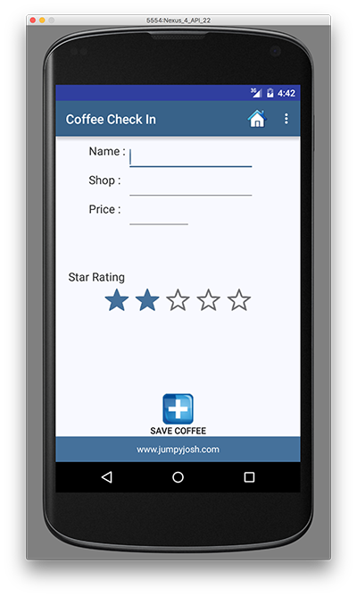
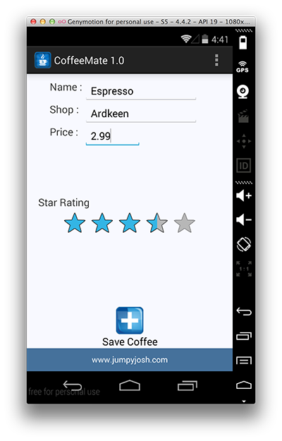
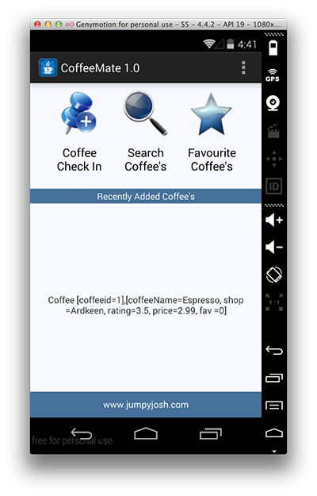

#Adding a Coffee - Saving our data in 'Coffee Check In'

Our Add screen looks as follows:

So, first of all, we need to bind to each of the widgets to 'get at' the new coffee details (possibly like this) - where would be the best place for this code?

~~~
 name = (EditText) findViewById(R.id.nameEditText);
 shop = (EditText) findViewById(R.id.shopEditText);
~~~

Specifically, the <b><i>add()</i></b> method needs to

- Grab all the values that the user has entered for the Coffee details, validate them & create a Coffee object

- Add the Coffee object to our list (coffeeList)

- Launch the "<b>Home</b>" Activity to return to the home screen, to display the current list of Coffee objects (probably via a call to <b><i>goToActivity()</i></b>)

Without referring to the notes (too much!) try and get this working, but here's some extracts to get you started.

~~~
coffeeName = name.getText().toString();
coffeeShop = shop.getText().toString();
	try {
	coffeePrice = Double.parseDouble(price.getText().toString());
	}
	catch(NumberFormatException e){
	coffeePrice = 0.0;
	}
ratingValue = ratingBar.getRating();
~~~
 
and this

~~~
Coffee c = new Coffee(coffeeName, coffeeShop, ratingValue, coffeePrice,0); 
coffeeList.add(c);

goToActivity(this,Home.class,null);
~~~

  

Run the App once again to confirm the add feature is now implemented.

